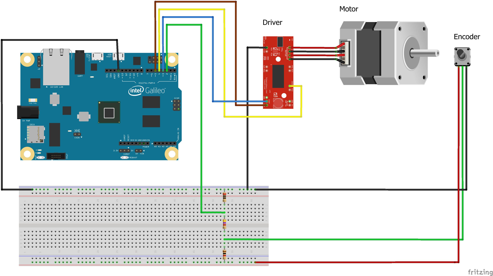
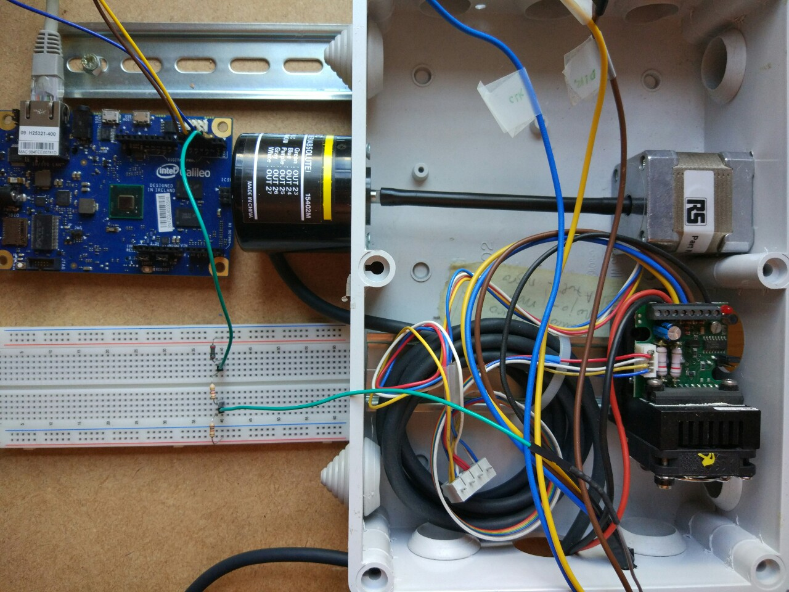

# Stepper motor control using Intel Galileo
This project shows a stepper motor control using Intel Galileo Microcontroller through an Android App over local Ethernet. Intel Galileo has been programmed using Arduino language.

## Scheme drawn using Fritzing



## Real Scenario



## Video

<a href="http://www.youtube.com/watch?feature=player_embedded&v=9_a-HLPgUDw" target="_blank"></a>

https://youtu.be/9_a-HLPgUDw


## Components

* **Stepper Motor** - model 17HS-240E
* **Driver** - model SMC42
* **Encoder** - model E6CP-AG5C
* **Microcontroller** - Intel Galileo Gen 1

## Arduino Code Explanation

**Delay Loop:**
```C
    // Delay loop
    cont =0;
    while (cont <( velocity ))
    {
        cont ++;
    }
    // CLK driver motor
    x=!x;
    digitalWrite (3, x);
}
```

This fragment of code is the one responsible for slowing the frequency of the main loop, by executing another internal loop. Arduino provides us with a delay function(milisec), but the minimum wait is 1 millisecond, which implies at most 1000 writes per second, and considering that our engine needs 800 pulses to complete one spin the speed would be about one revolution per second.

The speed of the main loop should be, according to the technical specifications, 400MHz. However, after measuring the frequency with an oscilloscope, it shows a frequency of 40MHz, 10 times less. I suppose this would be due to the time it takes to check if the UDP buffer
Contains data or not. Therefore, for the engine to go at a speed of, for example, 120 revolutions per minute(RPM), we obtain the number of cycles that are to be expected in the reduction as follows:

    40.000.000Hz/800 steps per spin = 50.000 spins per second
    50.000 spins x 60 seconds = 3.000.000 revolutions per minute(RPM)

Therefore, the loop would have to wait (3.000.000 / RPM speed) cycles in each cycle of the The main loop, so that the motor is at that speed. In our case, if we want the Initial speed is 120RPM, the loop will have to wait (3,000,000 / 120 = 25,000) cycles, In each cycle of the main loop.

The last step of the main loop sends the clock signal to the motor driver to advance one step.


**slowStop():**
```C
void slowStop (){
    int speedFactor = 20000000/ velocity ;
    for ( int i = 0; i< speedFactor ; i ++) {
        cont =0;
        while (cont < velocity +(( velocity / speedFactor )*i)) cont ++;
        x=!x;
        digitalWrite (3, x);
    }
    digitalWrite (4, LOW);
}
```

This function is responsible for making a progressive stop. As we can see, this code consists of two loops, the outer loop marks the number of turns that it will take to stop, while the inner loop is responsible for varying the space between the signals sent to the motor.

The algorithm may seem a little complicated. At first, speedFactor had a value of 3200, or what is the same 4 turns of the motor. This means that the engine always last 4 turns to stop. For a speed of 120RPM, stopping at 4 turns is a valid behavior, but at a speed of 1 revolution per minute it will take us 4 minutes to stop. From this I changed the value of speedFactor to be proportional to the motor speed, in such a way that it takes half a second to brake, instead of 4 turns, which has a lot more sense. The calculations performed are as follows:

    At a speed of 120RPM, half second is 1 spin.
    Number of spins to stop in 0.5 segundos = X/speed(in cicles)
    1x800 = X/25.000cicles(120RPM)
    X = 20.000.000
    int speedFactor = 20000000/velocity;
    
This way we get the formula of the number of laps we need to stop the motor in half a second, regardless of motor speed.

**slowStart():**
```C
void slowStart (){
    digitalWrite (4, HIGH );
    int speedFactor = 20000000/ velocity ;
    for ( int i = 0; i< speedFactor ; i ++) {
        cont =0;
        while (cont < velocity *2 -(( velocity / speedFactor )*i)) cont ++;
        x=!x;
        digitalWrite (3, x);
    }
}
```
The slowStart() function is exactly the same as the previous one, but instead of decelerating, it speeds up to the current speed.
